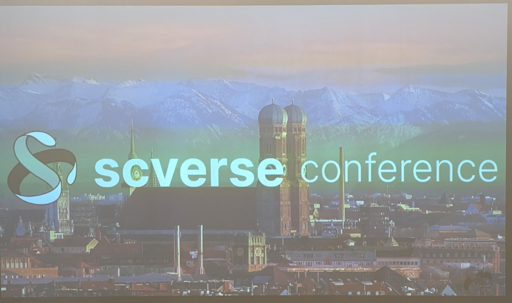

# SCVERSE Conference 2024

Notes on scverse conference 2024 in Munich 
The conference was held on 10-12 September 2024 in Munich. 

## First Day

### 1. What is new @ scverse
1. Scanpy 2.0 will have dask, more speed, and better implementation of knn methods.

### 2. Upstream of the single-cell data deluge: On the importance of accurate, efficient, and open methods for preprocessing single-cell data 
**Rob Patro** (University of Maryland) (**keynote**)

1. preprocessing matters: [paper](https://www.biorxiv.org/content/10.1101/2024.08.10.607413v1.full) 

    * Tremendous degree of variation between which barcodes are called, and the corresponding expression assigned to genes. 
    * This variation also varies between datasets and organisms. 

2. CellRanger only outputs genes/lncRNAs 

3. Alevin-fry will output → spliced, unspliced, and ambiguous count matrices ([GitHub](https://github.com/COMBINE-lab/alevin-fry))
    * It uses transcriptome as reference. 
    * It indexes both spliced and unspliced transcriptome. 
    * It corrects cell barcodes: 
        * First get the barcodes with 100% assurance 
        * Then check again the whitelist and if possible correct the barcode and if not remove the barcode 
    * It is fast and memory friendly (less than 4 GB memory for 10X 2020A reference) 

4. Simpleaf is the simple af version of alevin-fry ([GitHub](https://github.com/COMBINE-lab/simpleaf)) 
    * It is aware of context and semantics of running alevin-fry 
    * It propagates important metadata through analysis 
    * Allows tracking data provenance (what reference and what tool were used) 
    * Improves reproducibility 

5. Do not use processed matrices unless you are sure about data provenance: 
    * What was the data 
    * What was the reference 
    * How was it processed 
    * Which tools 
    * Which versions 

6. Data provenance is important. 
    * What has Rob did? 
        * Tximport imports transcripts abundance with metadata 

7. QC tools:
    * AlevinQC is a bioconductor app (shiny version is available)
    * Alevin-fryQC is under development (beta version is available) 

8. Articles to read in this section: 
    * [Alevin-fry](https://www.nature.com/articles/s41592-022-01408-3) 
    * [simpleaf](https://academic.oup.com/bioinformatics/article/39/10/btad614/7295550) 
    * [Single-cell best practice](https://www.nature.com/articles/s41576-023-00586-w) 

### 3. User-friendly exploration of (epi)genomic data in single cells using sincei
**Vivek Bhardwaj** (Utrecht University) 

1. Cell state is maintained by several epigenetic regulations. 

2. Problems in sc-DNA assays
    * **QC:** standard sc QC is not enough 
    * **Quantification:** No natural unit for quantifying the signal 
    * **Statistics:** data distribution depends on assay and features 
    * **Ease of use:** Challenging to work 

3. Sincei overcomes this problems 
    * QC based on assay 
    * Has assay-specific data distribution 
    * Aggregate signal and visualize over genomic regions 

4. [GitHub](https://github.com/bhardwaj-lab/sincei)

### 4. Unleashing the potential of multiplexed imaging experiments  
**Angela Oliveira Pisco** (insitro) (**keynote**)

1. They use DINO-ViT which is a self-supervised learning method to study ALS samples. 
    * In Self-supervised learning the data is provided without label and model uses subsets and augmentations of input to categorize samples 
    * There is no train and test datasets 
    * It is a vision transformer. It is alternative to convolutional neural network which converts images into an embedding 

2. On ALS samples they use this model to create embeddings capturing ALS-relevant information 

3. The want to: 
    * Predict healthy vs sick 
    * Predict classical features 
    * Impute transcriptomics from image embeddings 

4. She claimed DINO-VIT embeddings are better than pre-trained model embeddings 

5. POSH platform (Pooled Optical Screening in Human Cells) 
    * It is a CRISPR system on single-cell level (different mutation on each cell) 

### 5. Immunai 
**Sponsor talk** (immunai)
1. They are building a big database for immunity called AMICA 
2. They call it google map of immune system 
3. They want to improve drug development 

## Second Day

### 6. Higher throughput and fidelity screens with higher accuracy barcode decoding 
**John Hawkins** (EMBL)

Introduced SDR-seq (Single-cell DNA and RNA sequencing) which improves CRISPR screenings.

### 7. Characterizing cell state heterogeneity in a primary acute myeloid leukemia hierarchy using Single-Cell Proteomics by Mass Spectrometry 
**Pedro Aragon Fernandez** (Technical University of Denmark)

He is single-cell mass spectrometry to study AML

### 8. NeuroVelo: interpretable learning of temporal cellular dynamics from single-cell data 
Idris Kouadri Boudjelthia (SISSA)

1. Problem: scRNA-seq is only a static snapshot of RNA abundance at a point of time

2. Solution: RNA velocity models try to reconstruct a pseudotime model based on this snapshot

3. He presented [NeroVelo](https://github.com/idriskb/NeuroVelo) which uses neural network to model the dynamics.

### 9. Machine learning for regulatory genomics at single-cell resolution 
**Christina Leslie** (MSKCC) (**keynote**)

Let's try to map gene regulatory events in 1D and 3D

* 1D epigenomic assay (e.g. ATAC-seq) maps regulatory elements
* 3D chromosome conformation capture assays (e.g. Hi-C) maps their connectivity

1. Learning a sequence-informed embedding of scATAC-seq with [CellSpace](https://github.com/zakieh-tayyebi/CellSpace)
    * Typical analysis pipelines use scRNA-seq pipeline with cells x peaks
        * It is very sparse, high-dimensional peak/bin space, challenging batch effects
    * CellSpace can overcome that.
        * It embeds TF motifs in the latent space which allows computing TF activity score
        * It can correct batch effects (even better than harmony for example)
        * It doesn't overcorrect the batch effect
        * It uses DNA k-mer based embedding to learn scATAC-seq structure
            * Highly scalable (1M cells)
            * Can train on highly variable tiles or peaks or full peak atlas
2. Predicting the Hi-C contact map from scATAC-seq using a deep learning model, [ChromaFold](https://github.com/viannegao/ChromaFold)
    * Can we predict 3D chromatin interactions from scATAC-seq?
        * Co-accessibility in scATAC-seq gives some signal about 3D contacts
    * ChromaFold predicts this contacts
    * It is a supervised deep learning model which accurately predicts the Hi-C contact matrix from scATAC-seq
        * It is relatively lightweight and can be trained on standard GPUs
        * It generalizes to novel cell types and genomes
        * It strongly outperforms [Cicero](https://github.com/stjude/Cicero)
        * It performs equivalently to state-of-the-art [C.Origami](https://github.com/tanjimin/C.Origami), even without using ChIP-seq
3. Learning gene-level Poisson regression model from single-cell multiome data, [SCARlink](https://github.com/snehamitra/SCARlink)
    * It learns gene-level prediction models from multiome data
    * It is a Poisson regression model for predicting single-cell gene expression from single-cell accessibility in multiome data.
        * It interprets model to link enhancers to genes
        * It Enforces positive regression coefficients
        * It functionalizes genetic variants
    * It outperforms other gene expression prediction scores.
        * [ArchR](https://github.com/GreenleafLab/ArchR) gene score and [DORC](https://github.com/buenrostrolab/FigR/) score

### 10. Many anecdotes make a novel? Study-centered analysis and training models
**Alex wolf** (CEO of Lamin) (keynote)

1. Before 2015 High-dim data with high #obs were rare outside imaging
2. May 2015: droplet-based scRNA-seq → now we have 60k obs
3. Existing tools like Seurat, scater, CellRanger, do not scale to this increasingly.
4. There is a need for a python tool which is fast (R is slow)
    * scanpy r0: Just a simple command line tool
    * scanpy r1: A python toolkit that operates on annotated matrices (ddata)
    * scanpy v0.1: A toolkit that operates on Anndata (sliceable array unlike ddata)
    * Then it was scaled to 1M cells, and then it used h5ad (to store and stream from disk)
    * Now it is a community project
    * Many tools were developed using this datatype and at one point they decided to team up and speak to each other → scverse

### 11. DeepSpaCE: A deep learning framework to detect spatial single cell domains 
**Behnam Yousefi** (UKE)

1. Spatial domains:
    * Distinct spatially related regions within a tissue
    * Often corresponding to specific anatomical structures or functions
    * Used to understand organ function, development, and disease pathology
2. DeepSpaCE model uses graph (genes as nodes and spatial proximity as edge) to find these domains.
3. It outperforms [SCAN-IT](https://github.com/zcang/SCAN-IT), [Bansky](https://github.com/prabhakarlab/Banksy), [SpaceFlow](https://github.com/hongleir/SpaceFlow), and [squidpy](https://github.com/scverse/squidpy)
4. DeepSpaCE provides a reliable and robust deep learning-based method to detect spatial domains at single-cell level in an unsupervised framework.
5. It is not yet published

### 12. scPortrait: Building single cell representations based on microscopy images 
**Sophia Mädler** (Max Planck Institute of Biochemistry)

1. scPortrait is a scalable toolkit to generate single-cell representations from raw microscopy images. ([GitHub](https://github.com/MannLabs/scPortrait))
    * It is fast and scalable
    * out-of-memory computation
    * still under development
