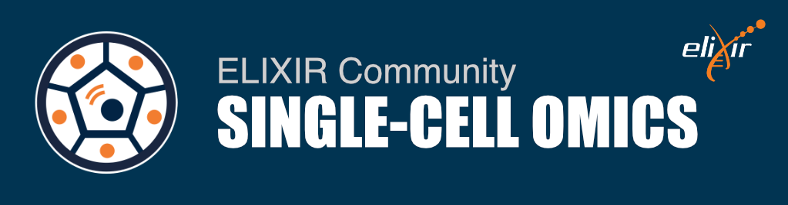

# Spatial Omics Data Analysis

The spatial omics data analysis course was organized by [SIB](https://www.sib.swiss/) and [ELIXIR single-cell community](https://elixir-europe.org/communities/single-cell-omics) on 21-24th January 2025 in Lausanne, Switzerland.

This course delves into the cutting-edge field of Spatial Omics, focusing on Spatially-Resolved Transcriptomics (SRT) technology which provides unprecedented insights into the spatial organization of gene expression within tissues. The rapid and recent advances in SRT technology are transforming our understanding of biological systems, and this course is designed to equip researchers with the tools to harness the power of SRT, adding significant value to biological knowledge and opening new avenues for scientific discovery.

---

**Index:**
+ Overview of technologies
+ Imaging-based spatial data analysis
+ Segmentation-free analysis
+ Sequence-based data analysis
+ Integration with scRNA-seq, deconvolution, annotation, imputation
+ Graph representations and niche reconstruction
+ Spatial domain identification and spatial annotation
+ Spatial statistics
+ Cell-cell communication

---

[Link to the Course website](https://www.sib.swiss/training/course/20250121_SPODA)

[Link to the Course materials](https://github.com/elixir-europe-training/ELIXIR-SCO-spatial-omics)

